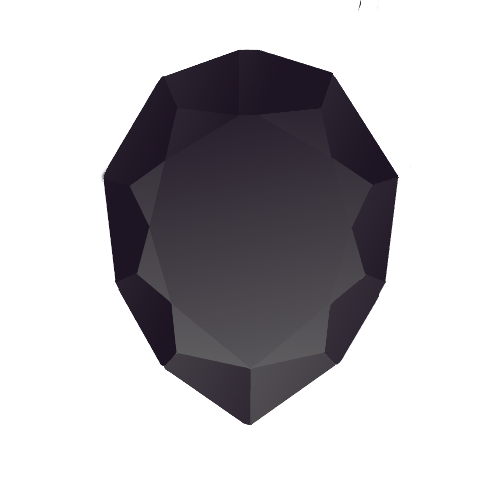

<p align="center">
    
</p>
<h1 align="center">Onyx</h1>


# 📝About the project


This code converts your Obsidian repository into a convenient website that you can host and share with others.


---

# 💻Installation


First, you need to copy the repository to your local computer, create a virtual environment, and install the components required for the project:

```
git clone https://github.com/laym0z/Converter.git
cd Converter
python3 -m venv venv

#activate on Windows
.\venv\Scripts\activate

#activate on Linux
source venv/bin/activate

#pip install on Windows
.\venv\Scripts\pip.exe install -r requirements.txt

#pip install on Linux
venv/bin/pip install -r requirements.txt
```

---

# ⚙️Command options


```
--src [PATH]    # the source obsidian vault
--dst [PATH]    # the destination foulder where is converted vault gonna be stored

--ri            # write and overwrite index.html
--rc            # write and overwrite style.css
--overwrite     # overwrite every sinle file from vault
```

---

# 🎓Example of use


## First start

```
.\venv\Scripts\python.exe .\converter.py --src "D:\Source\Path" --dst "D:\Destination\Path" --rc --ri
```

## Regular use

```
.\venv\Scripts\python.exe .\converter.py --src "D:\Source\Path" --dst "D:\Destination\Path" --ri --rc --overwrite
```

```
.\venv\Scripts\python.exe .\converter.py --src "D:\Source\Path" --dst "D:\Destination\Path"
```

---

## Main Page

You can make the `index.md` file in the same directory with `converter.py` and cusomize it with simple MD syntax (NOT OBSIDIAN!). Then just use `--ri` option to rewrite changes.